# 📚 Algorithm Reference Architecture

> [!NOTE]
> This document serves as the canonical reference for the internal search and pathfinding routing engine. It outlines the operational characteristics, asymptotic complexities, and topological heuristics utilized across our distributed pathfinding layers.

## 🧭 Taxonomy of Search Heuristics

The following matrix defines our core pathfinding strategy and algorithmic fallbacks.

| Algorithm | Archetype | Heuristic Target | Production Use-Case | Advantages | Disadvantages |
|-----------|-----------|------------------|---------------------|------------|---------------|
| **BFS** | Uninformed | *Shortest Levels* | Layer-wise topological sweeps, unweighted graph shortest-path | ✅ Complete   ✅ Optimal | ❌ Exponential memory overhead |
| **DFS** | Uninformed | *Deepest Branch* | Sub-tree exhaustion, state-space backtracking | ✅ Constant-space memory | ❌ Infinite loops without cyclic-checks |
| **UCS** | Uninformed | *Cheapest Cost* | Cost-weighted geographic routing (e.g., Maps API) | ✅ Optimal | ❌ Extensive state expansion |
| **GBFS** | Informed | *Best Heuristic* | Fast approximation pipelines, real-time autonomous navigation | ✅ Hyper-fast execution | ❌ Sub-optimal routing |
| **A\*** | Informed | *Cost + Heuristic*| Core engine for robotics, gaming, and GPS vectoring | ✅ Optimal & Complete | ❌ Open-list memory exhaustion |
| **DLS** | Uninformed | *DFS w/ Limit* | Bounded environment constraint checks | ✅ Bounded memory | ❌ Search horizon cutoffs |
| **IDDFS** | Uninformed | *Repeated DLS* | Blind, unknown-depth topological queries | ✅ BFS completeness with DFS memory footprint | ❌ Redundant node re-expansion |
| **IDA\*** | Informed | *Memory A\** | High-dimensional state puzzles, embedded memory systems | ✅ Low footprint & Optimal | ❌ Heavy CPU cycles for re-expansion |
| **Bi-Dir**| Uninformed | *Meet in Middle* | O-to-D transportation mesh networking | ✅ Massive time reduction | ❌ Requires symmetric reversibility |

---

## 🔍 Structural Flow Comparisons

### Breadth-First vs. Depth-First Expansion

```mermaid
graph TD
    subgraph "BFS (Level-Order Expansion)"
        A_BFS((A)) --> B_BFS((B))
        A_BFS --> C_BFS((C))
        B_BFS --> D_BFS((D))
        B_BFS --> E_BFS((E))
        C_BFS --> F_BFS((F))
        C_BFS --> G_BFS((G))
        style A_BFS fill:#0d1117,stroke:#58a6ff,stroke-width:2px
        style B_BFS fill:#0d1117,stroke:#3fb950,stroke-width:2px
        style C_BFS fill:#0d1117,stroke:#3fb950,stroke-width:2px
    end

    subgraph "DFS (Deepest-Branch Expansion)"
        A_DFS((A)) --> B_DFS((B))
        B_DFS --> D_DFS((D))
        D_DFS -.->|Backtrack| B_DFS
        B_DFS --> E_DFS((E))
        style A_DFS fill:#0d1117,stroke:#58a6ff,stroke-width:2px
        style B_DFS fill:#0d1117,stroke:#3fb950,stroke-width:2px
        style D_DFS fill:#0d1117,stroke:#a371f7,stroke-width:2px
    end
```

### The A* Heuristic Engine

The A* algorithm remains our gold standard. It calculates the most efficient vector by computing:

> [!IMPORTANT]
> **f(n) = g(n) + h(n)**
> *   `g(n)`: Absolute path cost from the origin to node *n*.
> *   `h(n)`: Estimated traversal cost from node *n* to the destination.

---
*Maintained by the Core Pathfinding Team*
